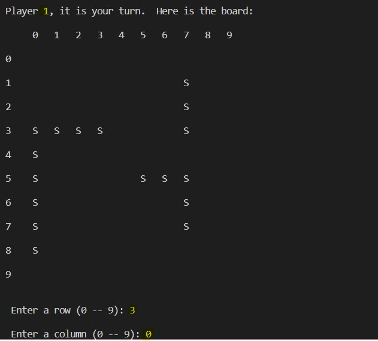

# Battleship

## Player 1 Board

## Miss

## Player 2 Board

## Hit

## Description

Everyone knows that video games are dead. Classic board games are all the rage. I'm sure you
spend hours on Youtube watching Chutes & Ladders tournaments. This game consists of 10 by 10 board where you have your battleships. The objective is to sink another player fleet before they sink yours. When you sink the fleet of your opponent then you will win the game.

## Language

- Java
